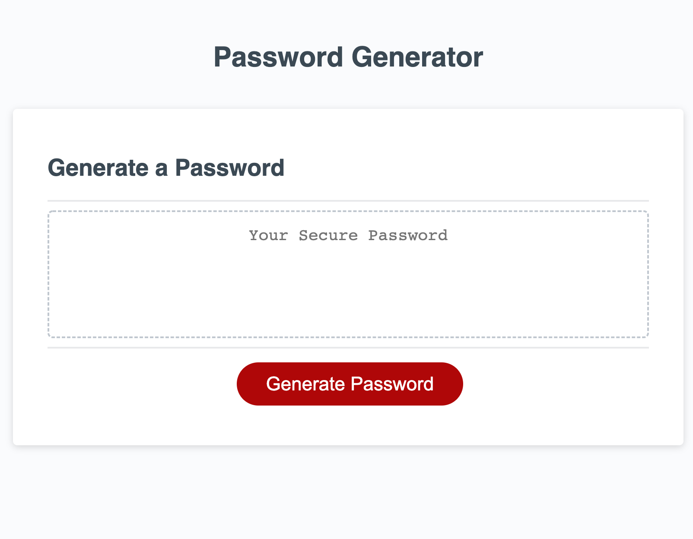

# Password-Generator

## Table of Contents 
1. [Description](#description)
2.  [Visuals](#visuals)
3. [Resources](#resources)

## Author:

Justin Stone

## Description

This is a password generator, it produces a password based on the users preferences on length and the inclusion of lowercase, uppercase, numeric and/or special characters. The password based on their specifications is then alerted to the screen and returned to the secure password placeholder text in the box.

## Visuals

## Resources
[LIVE SITE](https://justinstone2001.github.io/Password-Generator/)

[Repository](https://github.com/Justinstone2001/Password-Generator)